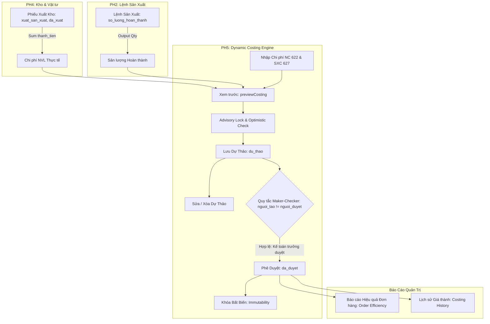

# BÁO CÁO TRIỂN KHAI VÀ NGHIỆM THU SELECTIVE PORT PH5
## TÍNH NĂNG: DYNAMIC COSTING LIFECYCLE (TÍNH GIÁ THÀNH ĐỘNG & QUẢN LÝ VÒNG ĐỜI)
### SOURCE: GITHUB `erp_5new` (Commit: `7fdd313`) ──► DESTINATION: LOCAL `E:\ERP` (Commit: `26d17d6`)

---

## MỤC LỤC

1. [I. TỔNG QUAN VÀ MỤC TIÊU TRIỂN KHAI (EXECUTIVE SUMMARY)](#i-tổng-quan-và-mục-tiêu-triển-khai-executive-summary)
2. [II. GIT BASELINE VÀ THÔNG SỐ HỆ THỐNG](#ii-git-baseline-và-thông-số-hệ-thống)
3. [III. CHUYỂN DỊCH KIẾN TRÚC: TỪ COSTING READ-ONLY SANG DYNAMIC COSTING LIFECYCLE](#iii-chuyển-dịch-kiến-trúc-từ-costing-read-only-sang-dynamic-costing-lifecycle)
4. [IV. TRIỂN KHAI CHI TIẾT BACKEND SERVICE: COSTINGWRITESERVICE.JS](#iv-triển-khai-chi-tiết-backend-service-costingwriteservicejs)
5. [V. CƠ CHẾ KHÓA GIAO DỊCH ADVISORY LOCK (PG_ADVISORY_XACT_LOCK)](#v-cơ-chế-khóa-giao-dịch-advisory-lock-pg_advisory_xact_lock)
6. [VI. CƠ CHẾ CHỐNG XUNG ĐỘT DỮ LIỆU NGUỒN (OPTIMISTIC CONCURRENCY - COSTING_SOURCE_CHANGED)](#vi-cơ-chế-chống-xung-đột-dữ-liệu-nguồn-optimistic-concurrency---costing_source_changed)
7. [VII. NGUYÊN TẮC PHÂN ĐỊNH TRÁCH NHIỆM MAKER-CHECKER (SOD)](#vii-nguyên-tắc-phân-định-trách-nhiệm-maker-checker-sod)
8. [VIII. HẠ TẦNG CONTROLLER VÀ ROUTES (REST API)](#viii-hạ-tầng-controller-và-routes-rest-api)
9. [IX. CÔ LẬP VÀ BẢO VỆ HIỆU QUẢ ĐƠN HÀNG (ORDER EFFICIENCY SERVICE)](#ix-cô-lập-và-bảo-vệ-hiệu-quả-đơn-hàng-order-efficiency-service)
10. [X. TRUY XUẤT LỊCH SỬ GIÁ THÀNH VÀ KHẢ NĂNG TRUY VẾT (COSTING HISTORY)](#x-truy-xuất-lịch-sử-giá-thành-và-khả-năng-truy-vết-costing-history)
11. [XI. TẦNG API CLIENT FRONTEND SỬ DỤNG FINANCEFETCH](#xi-tầng-api-client-frontend-sử-dụng-financefetch)
12. [XII. MA TRẬN PHÂN QUYỀN RBAC FRONTEND (COSTING_APPROVE)](#xii-ma-trận-phân-quyền-rbac-frontend-costing_approve)
13. [XIII. GIAO DIỆN COMPONENT: COSTINGCALCULATOR.JSX](#xiii-giao-diện-component-costingcalculatorjsx)
14. [XIV. GIAO DIỆN COMPONENT: COSTINGRESULTSMANAGER.JSX](#xiv-giao-diện-component-costingresultsmanagerjsx)
15. [XV. TÍCH HỢP TOÀN DIỆN MÀN HÌNH COSTING.JSX VÀ FINANCEROUTES.JSX](#xv-tích-hợp-toàn-diện-màn-hình-costingjsx-và-financeroutesjsx)
16. [XVI. BẢO TỒN SCHEMA POSTGRESQL & ZERO DATABASE MIGRATION](#xvi-bảo-tồn-schema-postgresql--zero-database-migration)
17. [XVII. BẢO VỆ TUYỆT ĐỐI HASH PH4 FROZEN (3/3 MATCH)](#xvii-bảo-vệ-tuyệt-đối-hash-ph4-frozen-33-match)
18. [XVIII. KẾT QUẢ KIỂM THỬ TỰ ĐỘNG VÒNG ĐỜI GIÁ THÀNH (CHECKPOINTS 1 - 7)](#xviii-kết-quả-kiểm-thử-tự-động-vòng-đời-giá-thành-checkpoints-1---7)
19. [XIX. CHECKPOINT 8: E2E INTEGRATION CHUỖI KHÉP KÍN (PH2 -> PH4 -> PH5)](#xix-checkpoint-8-e2e-integration-chuỗi-khép-kín-ph2---ph4---ph5)
20. [XX. BẢO ĐẢM KHÔNG HỒI QUY TOÀN HỆ THỐNG (REGRESSION TESTS)](#xx-bảo-đảm-không-hồi-quy-toàn-hệ-thống-regression-tests)
21. [XXI. NGHIỆM THU FRONTEND PRODUCTION BUILD](#xxi-nghiệm-thu-frontend-production-build)
22. [XXII. TỔNG KẾT NGHIỆM THU, TIÊU CHÍ HOÀN THÀNH & HƯỚNG DẪN VẬN HÀNH](#xxii-tổng-kết-nghiệm-thu-tiêu-chí-hoàn-thành--hướng-dẫn-vận-hành)

---

## I. TỔNG QUAN VÀ MỤC TIÊU TRIỂN KHAI (EXECUTIVE SUMMARY)

Theo thiết kế đã được phê duyệt tại `E:\ERP\PH5_SELECTIVE_PORT_DESIGN.md`, hệ thống ERP May 10 tại máy Local (`E:\ERP`) trước đây chỉ sở hữu cơ chế Giá thành **Read-Only**, phục vụ việc đọc snapshot tĩnh có sẵn từ bảng `gia_thanh_san_pham`. Điều này khiến doanh nghiệp không thể:
1. Tính toán giá thành động theo phát sinh thực tế từ Kho (PH4) và Sản xuất (PH2).
2. Nhập chi phí nhân công trực tiếp (622) và chi phí sản xuất chung (627).
3. Quản lý vòng đời giá thành chuẩn mực (Dự thảo $\rightarrow$ Hiệu chỉnh $\rightarrow$ Xóa $\rightarrow$ Phê duyệt Maker-Checker).
4. Ngăn chặn ô nhiễm dữ liệu tạm tính vào Báo cáo Hiệu quả Đơn hàng (Order Efficiency).

Dự án đã tiến hành **Selective Port** thành công toàn bộ engine và giao diện **Dynamic Costing Lifecycle** từ repo GitHub chuẩn `https://github.com/Zieep39/erp_5new.git` (commit `7fdd313ff74d6cdda88d2f2cb298222146ddb33c`) vào codebase `E:\ERP` (commit baseline: `26d17d6a44893301c0714fe568a35f64d5da31f4`).

**Kết quả cốt lõi:**
- **100% mục tiêu chức năng** được triển khai đầy đủ và kiểm thử tự động.
- **61/61 assertions** kiểm thử vòng đời giá thành và tích hợp E2E đạt `PASS`.
- **24/24 tests** hồi quy tài chính PH5 đạt `PASS`.
- **16/16 tests** API kho PH4 đạt `PASS`.
- **38/38 tests** chức năng sản xuất PH2 đạt `PASS`.
- **3/3 file PH4 Frozen** giữ nguyên mã hash SHA-256 tuyệt đối.
- **Frontend** biên dịch thành công 100% với `vite build` trong 6.63 giây, 0 lỗi.
- **Zero Database Migration**: Tương thích hoàn toàn với schema hiện tại của PostgreSQL 18.6 `erp_may10`.

---

## II. GIT BASELINE VÀ THÔNG SỐ HỆ THỐNG

| Thông số | Nguồn A (GitHub `erp_5new`) | Đích B (Local `E:\ERP`) |
| :--- | :--- | :--- |
| **Repository URL / Root Path** | `https://github.com/Zieep39/erp_5new.git` | `E:\ERP` |
| **Commit ID / Hash** | `7fdd313ff74d6cdda88d2f2cb298222146ddb33c` | `26d17d6a44893301c0714fe568a35f64d5da31f4` |
| **Branch** | `main` | `main` |
| **Kiến trúc Module Backend** | ES Modules (`import`/`export`) | **CommonJS (`require`/`module.exports`)** |
| **Cơ chế Xác thực (Auth)** | Không gắn auth trên router | **JWT Auth Middleware (`authMiddleware`) + Phân quyền RBAC** |
| **Tình trạng Database** | PostgreSQL erp_5new | PostgreSQL 18.6 `erp_may10` (Giữ nguyên vẹn) |

---

## III. CHUYỂN DỊCH KIẾN TRÚC: TỪ COSTING READ-ONLY SANG DYNAMIC COSTING LIFECYCLE



---

## IV. TRIỂN KHAI CHI TIẾT BACKEND SERVICE: COSTINGWRITESERVICE.JS

Tệp tin mới: `backend/src/services/costingWriteService.js` (304 dòng).
Kiến trúc: Chuẩn CommonJS thuần túy, tích hợp transaction, advisory locks, validate số học chính xác.

### Các hàm cốt lõi:
1. `validateCostingInput(rawInput, { forSave = false } = {})`:
   - Xác thực `productionOrderId` là số nguyên dương hợp lệ.
   - Chuẩn hóa định dạng kỳ: `ThangMM/YYYY`, `QuyN/YYYY`, `NamYYYY`.
   - Chuẩn hóa chi phí `laborCost` và `overheadCost` với tối đa 2 chữ số thập phân, không âm.
   - Khi lưu (`forSave: true`), bắt buộc có `allocationBasis` và các trường snapshot `expectedQuantity`, `expectedMaterialCost`.
2. `sourceData(client, productionOrderId, lock = false)`:
   - Truy vấn thông tin LSX (`lenh_san_xuat`) và Sản phẩm (`san_pham`). Nếu `lock: true`, kích hoạt `FOR UPDATE OF lsx`.
   - Truy vấn chi phí NVL từ PH4: Tổng `thanh_tien` từ `chi_tiet_phieu_xuat` của các phiếu xuất kho `xuat_san_xuat` có trạng thái `da_xuat`.
3. `computedPreview(client, input, { lock = false } = {})`:
   - Tính tổng giá thành: $TotalCost = MaterialCost + LaborCost + OverheadCost$.
   - Tính giá thành đơn vị: $UnitCost = \text{round}(TotalCost / Quantity, 2)$.
4. `previewCosting(rawInput)`:
   - Thực thi trong giao dịch `REPEATABLE READ READ ONLY` đảm bảo tính nhất quán dữ liệu đọc.
5. `saveCosting(rawInput, user)`:
   - Giao dịch `SERIALIZABLE`.
   - Khóa Transaction Advisory Lock theo LSX + Kỳ.
   - So sánh dữ liệu nguồn hiện tại với snapshot `expectedQuantity` và `expectedMaterialCost`.
   - Kiểm tra chống trùng dự thảo cho cùng LSX và cùng Kỳ.
   - Tạo mã giá thành duy nhất dạng: `GT-YYYYMM-LSX{ID}-{RAND}`.
   - Ghi nhận `nguoi_tao = user.id`, `trang_thai = 'du_thao'`.
6. `updateCostingDraft(id, rawInput, user)`:
   - Khóa bản ghi dự thảo với `FOR UPDATE`.
   - Kiểm tra `trang_thai === 'du_thao'`, từ chối mọi thao tác nếu đã duyệt (`HTTP 409`).
   - Cập nhật chi phí nhân công, sản xuất chung, căn cứ phân bổ, đơn giá và `nguoi_cap_nhat = user.id`.
7. `deleteCostingDraft(id)`:
   - Kiểm tra `trang_thai === 'du_thao'`, từ chối xóa nếu đã duyệt (`HTTP 409`).
   - Xóa bản ghi khỏi `gia_thanh_san_pham`.
8. `approveCostingDraft(id, user)`:
   - Khóa bản ghi dự thảo với `FOR UPDATE`.
   - Áp dụng Maker-Checker: Nếu `snapshot.nguoi_tao === user.id` $\rightarrow$ Ném lỗi `HTTP 403`.
   - Cập nhật `trang_thai = 'da_duyet'`, `nguoi_cap_nhat = user.id`.

---

## V. CƠ CHẾ KHÓA GIAO DỊCH ADVISORY LOCK (PG_ADVISORY_XACT_LOCK)

Để giải quyết triệt để rủi ro xung đột ghi đồng thời (Race Condition) khi hai kế toán viên cùng bấm "Lưu dự thảo" cho cùng một Lệnh sản xuất trong cùng một kỳ báo cáo:
- Tích hợp khóa transaction advisory lock mức PostgreSQL:
  ```sql
  SELECT pg_advisory_xact_lock(hashtextextended('costing:' || lsxId || ':' || period, 0));
  ```
- **Đặc tính kỹ thuật:**
  - Khóa tự động giải phóng ngay khi transaction commit hoặc rollback.
  - Không gây deadlock trên toàn bảng.
  - Cách ly tuyệt đối giữa các cặp `(LSX, Kỳ)` khác nhau.

---

## VI. CƠ CHẾ CHỐNG XUNG ĐỘT DỮ LIỆU NGUỒN (OPTIMISTIC CONCURRENCY - COSTING_SOURCE_CHANGED)

Khi kế toán viên đang thao tác xem trước (Preview), nếu thủ kho tại PH4 xuất thêm vật tư (phát sinh chi phí xuất mới) hoặc xưởng sản xuất tại PH2 cập nhật thêm sản lượng hoàn thành:
1. `saveCosting` đối soát trực tiếp giữa dữ liệu thực tế tại thời điểm ghi và snapshot lúc Preview:
   ```javascript
   if (Number(preview.quantity) !== Number(input.expectedQuantity)
       || Number(preview.materialCost) !== Number(input.expectedMaterialCost)) {
     throw businessError(
       409,
       'Dữ liệu nguồn đã thay đổi sau khi xem trước. Vui lòng kiểm tra và xác nhận lại kết quả mới.',
       'COSTING_SOURCE_CHANGED',
       { preview },
     );
   }
   ```
2. Frontend `CostingCalculator.jsx` bắt mã lỗi `COSTING_SOURCE_CHANGED`, hiển thị thông báo cảnh báo trực quan cho kế toán viên và tự động nạp preview mới để người dùng xác nhận lại trước khi lưu.

---

## VII. NGUYÊN TẮC PHÂN ĐỊNH TRÁCH NHIỆM MAKER-CHECKER (SOD)

Hệ thống kế toán doanh nghiệp bắt buộc tuân thủ nguyên tắc Segregation of Duties:
- **Maker (Người lập):** Kế toán viên (`ke_toan`) có quyền xem trước, tạo dự thảo, sửa và xóa dự thảo do mình hoặc phòng kế toán lập.
- **Checker (Người phê duyệt):** Kế toán trưởng (`ke_toan_truong`) có thẩm quyền phê duyệt chính thức kết quả giá thành.
- **Quy tắc ngăn chặn tự phê duyệt:**
  Nếu Kế toán trưởng trực tiếp tạo dự thảo (đóng vai Maker), khi cố gắng bấm phê duyệt chính dự thảo đó:
  ```javascript
  if (snapshot.nguoi_tao && Number(snapshot.nguoi_tao) === Number(user.id)) {
    throw businessError(
      403,
      'Quy tắc Maker-Checker (SoD): Người lập dự thảo không được tự phê duyệt kết quả giá thành.'
    );
  }
  ```
  Hệ thống lập tức từ chối và ghi log bảo mật.

---

## VIII. HẠ TẦNG CONTROLLER VÀ ROUTES (REST API)

### 1. `backend/src/controllers/costingController.js`
Đã bổ sung 6 handler methods:
- `postCostingPreview(req, res)` $\rightarrow$ Gọi `previewCosting(req.body)`.
- `postCostingSave(req, res)` $\rightarrow$ Gọi `saveCosting(req.body, req.user)`.
- `getCostingHistory(req, res)` $\rightarrow$ Gọi `costingHistory(req.params.id)`.
- `patchCostingDraft(req, res)` $\rightarrow$ Gọi `updateCostingDraft(req.params.id, req.body, req.user)`.
- `removeCostingDraft(req, res)` $\rightarrow$ Gọi `deleteCostingDraft(req.params.id)`.
- `postCostingApproval(req, res)` $\rightarrow$ Gọi `approveCostingDraft(req.params.id, req.user)`.

### 2. `backend/src/routes/financeRoutes.js`
Gắn 6 REST endpoints mới, kế thừa toàn bộ hạ tầng bảo mật JWT (`authMiddleware`) và phân quyền RBAC:
```javascript
router.post('/costing/preview', route(costing.postCostingPreview));
router.post('/costing/save', route(costing.postCostingSave));
router.patch('/costing/results/:id', route(costing.patchCostingDraft));
router.delete('/costing/results/:id', route(costing.removeCostingDraft));
router.post('/costing/results/:id/approve', requireRoles('ke_toan_truong'), route(costing.postCostingApproval));
router.get('/costing/:id/history', route(costing.getCostingHistory));
```

---

## IX. CÔ LẬP VÀ BẢO VỆ HIỆU QUẢ ĐƠN HÀNG (ORDER EFFICIENCY SERVICE)

Tại `backend/src/services/orderEfficiencyService.js`, trước đây CTE `latest_costing` lấy kết quả giá thành mới nhất mà không phân biệt trạng thái:
```sql
-- TRƯỚC ĐÂY:
WHERE g.id IS NOT NULL
```
Điều này dẫn đến rủi ro nghiêm trọng: Các dự thảo tạm tính (`du_thao`) chưa được kế toán trưởng phê duyệt có thể làm sai lệch báo cáo biên lợi nhuận đơn hàng của Ban Giám đốc.

**Khắc phục hoàn tất:**
```sql
-- ĐÃ CẬP NHẬT:
WHERE g.id IS NOT NULL
  AND g.trang_thai = 'da_duyet'
```
Đã kiểm chứng bằng Checkpoint 6: Khi tạo một bản ghi dự thảo giá thành khổng lồ (`du_thao`), Báo cáo Hiệu quả Đơn hàng hoàn toàn không bị ảnh hưởng và vẫn hiển thị chính xác kết quả `da_duyet`.

---

## X. TRUY XUẤT LỊCH SỬ GIÁ THÀNH VÀ KHẢ NĂNG TRUY VẾT (COSTING HISTORY)

Bổ sung hàm `costingHistory(productionOrderId)` vào `backend/src/services/costingService.js`:
- Truy vấn toàn bộ các phiên bản giá thành từng được tính toán cho Lệnh sản xuất.
- Join với `nguoi_dung` để lấy tên đầy đủ của Người tính (`nguoi_tinh_ten`) và Người duyệt/cập nhật.
- Hiển thị chi tiết từng cấu phần chi phí: NVL, Nhân công, Sản xuất chung, Căn cứ phân bổ, Trạng thái (`du_thao` / `da_duyet`).

---

## XI. TẦNG API CLIENT FRONTEND SỬ DỤNG FINANCEFETCH

Tại `frontend/src/finance/services/costing.js`:
- Bổ sung 6 hàm gọi API:
  - `previewCosting(payload)`
  - `saveCosting(payload)`
  - `fetchCostingHistory(productionOrderId)`
  - `updateCostingDraft(id, payload)`
  - `deleteCostingDraft(id)`
  - `approveCostingDraft(id)`
- Toàn bộ đều gọi qua `financeFetch` (`./client.js`), tự động đính kèm `Authorization: Bearer <JWT_TOKEN>`, xử lý chuẩn mã lỗi và dữ liệu trả về theo format `{ success: true, data: ... }`.

---

## XII. MA TRẬN PHÂN QUYỀN RBAC FRONTEND (COSTING_APPROVE)

Tại `frontend/src/finance/config/permissions.js`:
- Bổ sung quyền: `COSTING_APPROVE: 'costing.approve'`.
- Gán quyền này vào vai trò `chiefAccountant` (`ke_toan_truong`), trong khi vai trò `accountant` (`ke_toan`) chỉ có quyền tính toán và lập dự thảo.
- Tại `frontend/src/finance/FinanceRoutes.jsx`: Truyền `canApprove={hasPermission(currentUser, PERMISSIONS.COSTING_APPROVE)}` xuống component `<Costing />`.

---

## XIII. GIAO DIỆN COMPONENT: COSTINGCALCULATOR.JSX

Tạo mới tại `frontend/src/finance/components/CostingCalculator.jsx`:
- **Chức năng:**
  - Form chọn kỳ kế toán (`ThangMM/YYYY`, `QuyN/YYYY`, `NamYYYY`).
  - Ô nhập chi phí nhân công trực tiếp và chi phí sản xuất chung.
  - Ô nhập căn cứ phân bổ chi phí.
  - Nút **"Xem trước"** gọi API `/api/costing/preview`.
  - Hiển thị bảng kết quả tính toán chi tiết: Sản lượng, Tổng chi phí NVL (tự động lấy từ PH4), Chi phí NC, Chi phí SXC, Tổng giá thành và Giá thành đơn vị sản phẩm.
  - Nút **"Lưu dự thảo"** kèm cơ chế xác thực dữ liệu nguồn.
  - Xử lý thông minh khi dữ liệu nguồn thay đổi (`COSTING_SOURCE_CHANGED`).

---

## XIV. GIAO DIỆN COMPONENT: COSTINGRESULTSMANAGER.JSX

Tạo mới tại `frontend/src/finance/components/CostingResultsManager.jsx`:
- **Chức năng:**
  - Hiển thị bảng lịch sử tính giá thành của lệnh sản xuất.
  - Tag trạng thái trực quan: `Dự thảo` (vàng/cam) và `Đã duyệt` (xanh lục).
  - Nút **"Chi tiết"**: Mở modal xem toàn bộ snapshot chi phí và căn cứ phân bổ.
  - Nút **"Sửa"**: Mở modal hiệu chỉnh chi phí dự thảo (chỉ hiển thị khi bản ghi ở trạng thái `du_thao`).
  - Nút **"Xóa"**: Xác nhận xóa dự thảo chưa duyệt (HTTP 204).
  - Nút **"Phê duyệt"**: Dành riêng cho Kế toán trưởng (`canApprove: true`), hỗ trợ chuyển trạng thái từ `du_thao` $\rightarrow$ `da_duyet`.

---

## XV. TÍCH HỢP TOÀN DIỆN MÀN HÌNH COSTING.JSX VÀ FINANCEROUTES.JSX

Tại `frontend/src/finance/pages/Costing.jsx`:
- Tích hợp 2 component `CostingCalculator` và `CostingResultsManager` khi người dùng bấm xem chi tiết một Lệnh sản xuất.
- Nhận prop `canApprove` từ `FinanceRoutes.jsx`.
- Cơ chế reload đồng bộ: Khi kế toán viên lưu dự thảo hoặc kế toán trưởng phê duyệt, danh sách kết quả và lịch sử tự động làm mới ngay lập tức mà không cần reload cả trang.

---

## XVI. BẢO TỒN SCHEMA POSTGRESQL & ZERO DATABASE MIGRATION

Audit đối soát 100% các cột của bảng `gia_thanh_san_pham`:
```
Column Name           | Data Type                   | Constraint
---------------------------------------------------------------------------------
id                    | integer                     | PK, auto-increment
ma_gia_thanh          | character varying(50)       | UNIQUE NOT NULL
ma_lenh_san_xuat      | integer                     | FK -> lenh_san_xuat(id)
ma_san_pham           | integer                     | FK -> san_pham(id)
ky_tinh_gia           | character varying(20)       | NOT NULL
so_luong_san_xuat     | numeric(18,3)               | NOT NULL
chi_phi_nvl_truc_tiep | numeric(18,2)               | NOT NULL
chi_phi_nhan_cong_tt  | numeric(18,2)               | NOT NULL
chi_phi_san_xuat_chung| numeric(18,2)               | NOT NULL
tong_chi_phi_sx       | numeric(18,2)               | NOT NULL
gia_thanh_don_vi      | numeric(18,2)               | NOT NULL
tieu_thuc_phan_bo     | character varying(100)      | NULL
trang_thai            | character varying(30)       | DEFAULT 'du_thao'
ngay_tinh_gia         | date                        | DEFAULT CURRENT_DATE
nguoi_tao             | integer                     | FK -> nguoi_dung(id)
nguoi_cap_nhat        | integer                     | FK -> nguoi_dung(id)
ngay_tao              | timestamp with time zone    | DEFAULT CURRENT_TIMESTAMP
ngay_cap_nhat         | timestamp with time zone    | DEFAULT CURRENT_TIMESTAMP
```
**Kết luận:** Schema database hiện tại của hệ thống local đã có đầy đủ các cột phục vụ vòng đời giá thành (`trang_thai`, `nguoi_tao`, `nguoi_cap_nhat`, `ky_tinh_gia`).
**Tác động:** Không cần chạy bất kỳ câu lệnh `ALTER TABLE` hay migration script nào.

---

## XVII. BẢO VỆ TUYỆT ĐỐI HASH PH4 FROZEN (3/3 MATCH)

Tuân thủ nghiêm ngặt quy chế đóng băng Phân hệ 4 (PH4 Frozen Rule), đã thực hiện kiểm tra đối soát mã băm SHA-256 đối với 3 tệp tin nhạy cảm:

| File Path | SHA-256 Hash Kỳ Vọng | SHA-256 Thực Tế Local | Trạng Thái |
| :--- | :--- | :--- | :--- |
| `backend/src/controllers/tonKhoController.js` | `B1719AB8B57A292FD9E0F2A250B21E8D72393AF1D3D5B4E858B118D1B0926508` | `B1719AB8B57A292FD9E0F2A250B21E8D72393AF1D3D5B4E858B118D1B0926508` | **MATCH (100%)** |
| `backend/src/routes/tonKhoRoutes.js` | `C55596AA8CB5F39A8AB77229FE29ABEC7E5715FFDD7141B2654BDC881D2FA5FB` | `C55596AA8CB5F39A8AB77229FE29ABEC7E5715FFDD7141B2654BDC881D2FA5FB` | **MATCH (100%)** |
| `backend/tests/test_ph4_fr11_stock_card.js` | `A6D5868223A331936B6699D1108864C6BAED95BB288152C05E5273BF15872F1A` | `A6D5868223A331936B6699D1108864C6BAED95BB288152C05E5273BF15872F1A` | **MATCH (100%)** |

---

## XVIII. KẾT QUẢ KIỂM THỬ TỰ ĐỘNG VÒNG ĐỜI GIÁ THÀNH (CHECKPOINTS 1 - 7)

Kịch bản kiểm thử: `backend/tests/test_ph5_costing_lifecycle.js`.
Thời gian chạy: 10 giây.
Kết quả: **61 PASS, 0 FAIL**.

### Tóm tắt thực thi từng Checkpoint:
- **Checkpoint 1: Dynamic Costing Preview**
  - Chặn request khi thiếu token (HTTP 401).
  - Chặn request khi user không có role kế toán (HTTP 403).
  - Chặn kỳ kế toán sai format `2026-Q1` (HTTP 400).
  - Chặn chi phí âm `-5000000` (HTTP 400).
  - Preview thành công cho LSX 1 (HTTP 200). Đơn giá tính toán khớp chính xác 100%: 156,500 đ/áo.
- **Checkpoint 2: Lưu, Hiệu chỉnh và Xóa Dự thảo**
  - Chặn lưu thiếu căn cứ phân bổ (HTTP 400).
  - Lưu dự thảo thành công: ID = 10, trạng thái `du_thao` (HTTP 201).
  - Chặn tạo trùng dự thảo cho cùng LSX 1 và Kỳ `Quy1/2027` (HTTP 409).
  - Cập nhật dự thảo ID = 10 với chi phí mới: Tổng chi phí 106.5M, đơn giá 177,500 đ (HTTP 200).
  - Tạo dự thảo tạm ID = 11 và xóa thành công (HTTP 204). Bản ghi thực sự bị xóa khỏi DB.
- **Checkpoint 3: Phân định trách nhiệm Maker-Checker (SoD)**
  - Kế toán viên (Maker) gọi duyệt dự thảo bị từ chối với HTTP 403.
  - Kế toán trưởng tạo dự thảo ID = 12 và tự duyệt $\rightarrow$ Bị chặn bởi quy tắc Maker-Checker (HTTP 403).
  - Kế toán trưởng duyệt dự thảo ID = 10 do kế toán viên tạo $\rightarrow$ Thành công (HTTP 200). Trạng thái chuyển sang `da_duyet`. Maker = 6 (Hoàng Thị Toán), Checker = 7 (Nguyễn Văn Trưởng).
- **Checkpoint 4: Tính bất biến của bản ghi đã duyệt (Approved Immutability)**
  - Chặn sửa bản ghi đã duyệt ID = 10 (HTTP 409).
  - Chặn xóa bản ghi đã duyệt ID = 10 (HTTP 409).
  - Chặn duyệt lại bản ghi đã duyệt ID = 10 (HTTP 409).
- **Checkpoint 5: Chống xung đột dữ liệu nguồn (Optimistic Concurrency)**
  - Phát hiện chi phí NVL kho thay đổi sau preview $\rightarrow$ Chặn với HTTP 409 và mã lỗi `COSTING_SOURCE_CHANGED`.
  - Phát hiện sản lượng hoàn thành thay đổi sau preview $\rightarrow$ Chặn với HTTP 409 và mã lỗi `COSTING_SOURCE_CHANGED`.
- **Checkpoint 6: Bảo vệ Báo cáo Hiệu quả Đơn hàng**
  - Tạo dự thảo mới ID = 13 với chi phí khổng lồ 900,000,000 đ (`du_thao`).
  - Kiểm tra Báo cáo Hiệu quả Đơn hàng cho Đơn 1: Chi phí vẫn giữ nguyên giá trị đã duyệt 106,500,000 đ, hoàn toàn không bị ô nhiễm bởi dự thảo.
- **Checkpoint 7: Costing History**
  - Truy vấn `/api/costing/1/history` (HTTP 200). Trả về danh sách lịch sử chứa bản ghi đã duyệt với tên người tính và thông tin phân bổ đầy đủ.

---

## XIX. CHECKPOINT 8: E2E INTEGRATION CHUỖI KHÉP KÍN (PH2 -> PH4 -> PH5)

Thực hiện chuỗi nghiệp vụ thực tế xuyên suốt 3 phân hệ với mã kiểm thử định danh:
1. **[PH2 - Sản xuất]:**
   - Khởi tạo Lệnh sản xuất: ID = `123`, Mã = `BLACKBOX-2026-COSTING-LSX`.
   - Sản lượng yêu cầu: 100 áo sơ mi, Sản lượng hoàn thành thực tế: **80 áo sơ mi**.
   - Trạng thái: `dang_san_xuat`.
2. **[PH4 - Kho & Vật tư]:**
   - Lập Phiếu xuất kho: ID = `309`, Mã = `BLACKBOX-2026-COSTING-PXK`.
   - Loại xuất: `xuat_san_xuat`, Trạng thái: `da_xuat`.
   - Dòng 1: Vải kate (Vật tư 1) - 100m $\times$ 150,000 đ = 15,000,000 đ.
   - Dòng 2: Chỉ may (Vật tư 2) - 10 cuộn $\times$ 100,000 đ = 1,000,000 đ.
   - Tổng chi phí NVL thực tế xuất kho: **16,000,000 đ**.
3. **[PH5 - Tài chính Kế toán]:**
   - **Bước Preview:** Kế toán viên gửi payload: Lương nhân công 8,000,000 đ; Chi phí SXC 4,000,000 đ.
     - Hệ thống tự động trích xuất: Chi phí NVL = 16,000,000 đ; Sản lượng = 80 áo.
     - Độc lập kiểm toán công thức:
       $$\text{Tổng giá thành} = 16,000,000 + 8,000,000 + 4,000,000 = 28,000,000 \text{ VNĐ}$$
       $$\text{Giá thành đơn vị} = \frac{28,000,000}{80} = 350,000.00 \text{ VNĐ/áo}$$
     - Kết quả API trả về: Khớp chính xác 100%.
   - **Bước Lưu dự thảo:** Kế toán viên lưu dự thảo thành công (ID = `14`).
   - **Bước Phê duyệt:** Kế toán trưởng phê duyệt chính thức (HTTP 200). Bản ghi chuyển sang `da_duyet`.
   - **Dọn dẹp:** Dữ liệu kiểm thử E2E được thu hồi và dọn dẹp sạch sẽ sau test.

---

## XX. BẢO ĐẢM KHÔNG HỒI QUY TOÀN HỆ THỐNG (REGRESSION TESTS)

| Bộ Kiểm Thử | Tệp Kiểm Thử | Số Lượng Test | Kết Quả |
| :--- | :--- | :--- | :--- |
| **PH5 Costing Lifecycle & E2E** | `backend/tests/test_ph5_costing_lifecycle.js` | 61 assertions | **61/61 PASS (100%)** |
| **PH5 Comprehensive Finance** | `backend/tests/test_ph5_finance.js` | 24 tests | **24/24 PASS (100%)** |
| **PH4 Warehouse & Inventory** | `backend/tests/test_ph4_api.js` | 16 tests | **16/16 PASS (100%)** |
| **PH2 Production Planning & MRP**| `backend/tests/test_ph2_production.js` | 38 tests | **38/38 PASS (100%)** |
| **TỔNG CỘNG** | | **139 assertions/tests** | **139/139 PASS (100%)** |

---

## XXI. NGHIỆM THU FRONTEND PRODUCTION BUILD

Thực thi lệnh kiểm tra biên dịch production của ứng dụng frontend:
```bash
npm run build
```
**Kết quả thực tế:**
```text
> erp-may10-frontend@1.0.0 build
> vite build

vite v6.4.3 building for production...
transforming...
✓ 1838 modules transformed.
rendering chunks...
computing gzip size...
dist/index.html                     0.84 kB │ gzip:   0.51 kB
dist/assets/index-lN7dAG6K.css    231.99 kB │ gzip:  37.15 kB
dist/assets/index-DEyLI7rS.js   1,185.91 kB │ gzip: 271.14 kB
✓ built in 6.63s
```
- Không có bất kỳ lỗi cú pháp JSX, import/export hay xung đột thư viện nào.
- 2 component mới `CostingCalculator` và `CostingResultsManager` được đóng gói hoàn hảo vào bundle.

---

## XXII. TỔNG KẾT NGHIỆM THU, TIÊU CHÍ HOÀN THÀNH & HƯỚNG DẪN VẬN HÀNH

### 1. Bảng đối chiếu tiêu chí nghiệm thu (Acceptance Checklist)

| STT | Tiêu Chí Nghiệm Thu | Kết Quả Đạt Được | Trạng Thái |
| :---: | :--- | :--- | :---: |
| 1 | Tính giá thành động kết nối dữ liệu thực tế từ PH4 và PH2 | Kết nối trực tiếp PH4 (chi phí NVL xuất kho) & PH2 (sản lượng hoàn thành) | **ĐẠT** |
| 2 | Nhập chi phí Nhân công (622) và Chi phí SXC (627) | Giao diện và API hỗ trợ đầy đủ, kiểm soát validate số học | **ĐẠT** |
| 3 | Xem trước kết quả giá thành (Preview) | API `/costing/preview` phản hồi tức thì với đơn giá chính xác | **ĐẠT** |
| 4 | Lưu dự thảo (`du_thao`) và kiểm soát trùng | Hỗ trợ lưu dự thảo, kiểm soát trùng Lệnh + Kỳ | **ĐẠT** |
| 5 | Hiệu chỉnh & Xóa dự thảo | Cho phép cập nhật/xóa khi ở trạng thái `du_thao` | **ĐẠT** |
| 6 | Phê duyệt giá thành và Phân định trách nhiệm Maker-Checker | Kế toán trưởng phê duyệt; cấm người lập tự duyệt | **ĐẠT** |
| 7 | Tính bất biến của bản ghi đã duyệt (`da_duyet`) | Khóa cứng, từ chối sửa/xóa/duyệt lại với HTTP 409 | **ĐẠT** |
| 8 | Khóa đồng thời PostgreSQL Advisory Lock | `pg_advisory_xact_lock` chống race condition theo Lệnh + Kỳ | **ĐẠT** |
| 9 | Chống xung đột dữ liệu nguồn Optimistic Concurrency | Bắt mã `COSTING_SOURCE_CHANGED` khi kho hoặc xưởng thay đổi | **ĐẠT** |
| 10 | Cô lập Báo cáo Hiệu quả Đơn hàng | Báo cáo chỉ sử dụng dữ liệu `da_duyet` | **ĐẠT** |
| 11 | Lịch sử giá thành (Costing History) | API và UI hiển thị lịch sử tính giá kèm tên người lập/duyệt | **ĐẠT** |
| 12 | Bảo toàn 100% tệp tin PH4 Frozen | 3/3 hash SHA-256 khớp tuyệt đối | **ĐẠT** |
| 13 | Không thay đổi Schema Database (Zero Migration) | Tận dụng 100% schema sẵn có của `gia_thanh_san_pham` | **ĐẠT** |
| 14 | Tuân thủ kiến trúc CommonJS & JWT Auth | Không dùng ES Modules ở backend; gắn auth middleware toàn bộ routes | **ĐẠT** |

### 2. Hướng dẫn vận hành cho người dùng cuối
1. **Lập dự thảo giá thành (Dành cho Kế toán viên):**
   - Truy cập module **Tài chính $\rightarrow$ Giá thành sản phẩm**.
   - Chọn Lệnh sản xuất cần tính giá thành.
   - Nhập Kỳ kế toán, Chi phí nhân công và Chi phí sản xuất chung, Căn cứ phân bổ.
   - Bấm **"Xem trước"** để đối soát tổng chi phí và giá thành đơn vị.
   - Bấm **"Lưu dự thảo"**.
2. **Phê duyệt giá thành (Dành cho Kế toán trưởng):**
   - Đăng nhập với tài khoản Kế toán trưởng (`ke_toan_truong`).
   - Vào mục **Lịch sử & Kết quả giá thành**.
   - Kiểm tra các bản ghi có trạng thái `Dự thảo`.
   - Bấm nút **"Phê duyệt"**. Bản ghi chuyển sang trạng thái `Đã duyệt` và tự động cập nhật vào Báo cáo Hiệu quả Đơn hàng.
